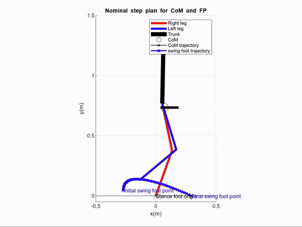
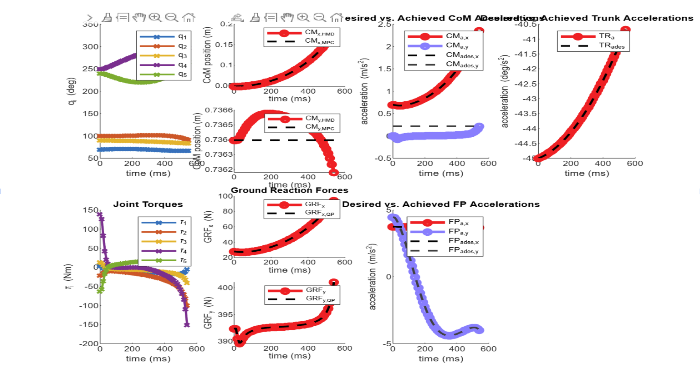
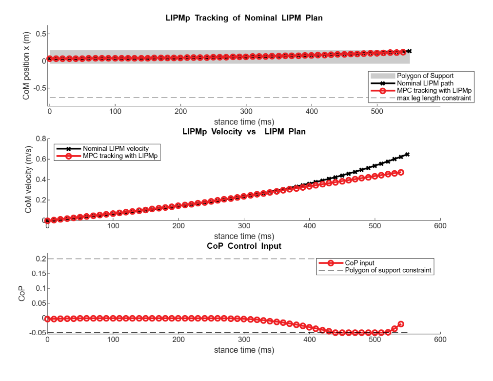
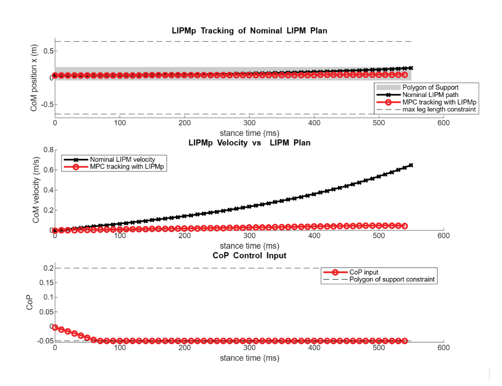

# Dual-Legged Robot Control

This repository contains a MATLAB implementation of a humanoid controller that tracks a walking behavior using a combination of Model Predictive Control (MPC) and Quadratic Programming (QP) for joint control and footstep planning. The humanoid's gait is designed using a Linear Inverted Pendulum Model (LIPM) for the center of mass (CoM) and a simple swing foot model for trajectory generation. The system simulates a humanoid robot walking, adjusting joint angles and velocities in real-time to follow desired trajectories.

## Implementation

Here is the movement of the legged robot:



In ideal conditions, the outputs look like this:



In real scenarios, surfaces can be slippery and can have a smaller friction coefficient.

For a surface that has friction coefficient of the order 10^-1



For a surface with extremely low friction, the humanoid loses the ability to track and control itself and fails



### Key Concepts and Methodology

1. **Model Predictive Control (MPC)**: 
   - Used to track the desired trajectory of the humanoid's Center of Mass (CoM) during the stance phase.
   - The controller optimizes the CoM position and velocity using a model of the humanoid's dynamics and constraints on the CoP (Center of Pressure) and foot positions.

2. **Quadratic Programming (QP)**:
   - Solves for the optimal joint accelerations and torques in real-time while maintaining balance and satisfying dynamics and kinematics constraints.
   - QP is used to compute joint trajectories and ground reaction forces (GRFs) based on the humanoid's current state and the desired dynamics.

3. **Swing Foot and Trunk Control**:
   - The swing foot is tracked using a PD controller that minimizes the error between the nominal swing foot path and the actual foot position.
   - The trunk is controlled with a PD controller to track the desired trunk pitch angle and velocity.

4. **Linear Inverted Pendulum Model (LIPM)**:
   - The LIPM is used to create a nominal CoM trajectory. It approximates the humanoid's dynamic behavior in the stance phase, where the humanoid is modeled as an inverted pendulum with a constant height for the CoM.
   - Desired CoM position and velocity are computed based on the walking speed and step length.

### Main Steps in the Code

1. **Initialization**:
   - Set initial joint angles and CoM position.
   - Define humanoid model parameters (gravity, step length, joint limits, etc.).
   - Initialize the humanoid simulator.

2. **Nominal Plans Creation**:
   - Generate the desired CoM, swing foot, and trunk trajectories using LIPM and a swing foot planner.
   - Visualize the initial step plans.

3. **Tracking through Stance Phase**:
   - Initialize the MPC for tracking CoM behavior.
   - Use QP to track foot placement and trunk motion while updating joint accelerations and torques.
   - Simulate the humanoid's movement using the updated joint commands.
   - Animate the humanoid robot to visualize its motion.

4. **Simulation**:
   - Iterate over each time step in the stance phase.
   - At each time step, update the desired CoM, swing foot, and trunk acceleration using MPC and PD control.
   - Solve the QP optimization problem for joint accelerations and torques.
   - Simulate the humanoid's motion based on the computed joint torques and display the updated configuration.

5. **Plotting**:
   - Plot the behavior of the CoM and joint tracking during the stance phase.
   - Display the performance of the MPC and humanoid controller in tracking the desired behavior.

### Files and Subfolders

- `mpc/`: Contains functions related to the Model Predictive Control for CoM tracking.
- `qp/`: Contains functions for solving the Quadratic Programming problem related to humanoid joint control and footstep planning.
- `simulator/`: Contains the functions for simulating the humanoid robot's motion.
- `symbolics/`: Contains symbolic computation tools used for calculating joint dynamics and constraints.

### Key Functions

- `SIM_InitHumanoidSimulator`: Initializes the humanoid simulator with specified parameters.
- `LIPM_NominalPlan`: Generates the nominal CoM trajectory using the LIPM.
- `SwingFootPlan`: Generates the trajectory for the swing foot based on the nominal CoM plan.
- `MPC_DefineLIPMpMPC`: Defines the MPC problem for CoM tracking.
- `MPC_TrackLIPM`: Tracks the CoM trajectory using the MPC algorithm.
- `QP_InitHumanoidQP`: Initializes the QP problem for humanoid control.
- `QP_UpdateDynamicsModel`: Updates the QP model based on current joint positions and velocities.
- `ShowStepPlan`: Visualizes the nominal step plan.
- `SIM_SimulateHumanoid`: Simulates the humanoid movement based on computed joint torques.
- `SIM_AnimateHumanoid`: Animates the humanoid robot during the simulation.

### Requirements

- MATLAB (tested with MATLAB R2018b)
- Control System Toolbox
- Optimization Toolbox

### Usage

1. Clone this repository.
2. Navigate to the `main.m` file and run the simulation by executing the script in MATLAB.
3. Adjust the humanoid model parameters and initial conditions to experiment with different walking behaviors.

```bash
git clone https://github.com/yourusername/humanoid-controller.git
cd humanoid-controller
matlab -r "main"
```
### Results
The simulation will show the humanoid robot walking using the generated joint trajectories.
The CoM and foot positions will be tracked using MPC and PD controllers.
Plots will show the tracking behavior of the CoM, foot, and trunk.
